# Automated Rule-Based Admission Decision System

## For: Confluence University of Science and Technology, Osara (CUSTECH)

### Features
- Rule-based candidate screening with configurable criteria
- Quota system (Merit, Catchment, ELDS)
- Aggregate score calculation with customizable formulas
- Mock JAMB CAPS integration
- Admission letter generation
- Comprehensive reporting and analytics
- Real-time system health monitoring
- User-friendly interface with loading spinners and confirmation modals
- Quick help tooltips for new users

### Installation
1. Clone repository
2. Create virtual environment: `python -m venv venv` 
3. Activate: `venv\Scripts\activate` (Windows) or `source venv/bin/activate` (Mac/Linux)
4. Install dependencies: `pip install -r requirements.txt` 
5. Copy `.env.example` to `.env` and set values
6. Initialize database: `flask db init && flask db migrate && flask db upgrade` 
7. Seed data: `flask seed` 
8. Generate test candidates: `flask generate-candidates 100` 
9. Run: `python run.py` 

### Default Login
- Username: admin
- Password: admin123

### Project Structure
```
admission_system/
|-- app/
|   |-- __init__.py              # Flask application factory
|   |-- forms.py                 # WTForms classes
|   |-- models.py                # SQLAlchemy models
|   |-- routes/                  # Blueprint routes
|   |   |-- __init__.py
|   |   |-- admin.py             # Admin dashboard routes
|   |   |-- admission.py         # Admission processing routes
|   |   |-- auth.py              # Authentication routes
|   |-- services/                # Business logic services
|   |   |-- __init__.py
|   |   |-- candidate_processor.py
|   |   |-- merit_list.py
|   |-- static/                  # Static assets
|   |   |-- css/
|   |   |-- js/
|   |   |-- favicon.ico
|   |-- templates/               # Jinja2 templates
|   |   |-- admin/               # Admin templates
|   |   |-- auth/                # Authentication templates
|   |   |-- errors/              # Error page templates
|   |   |-- base.html            # Base template
|   |-- utils/                   # Utility modules
|       |-- __init__.py
|       |-- helpers.py
|       |-- seed.py              # Database seeding utilities
|-- instance/                    # Instance-specific files
|-- migrations/                  # Database migration files
|-- uploads/                     # File upload directory
|-- config.py                    # Application configuration
|-- requirements.txt             # Python dependencies
|-- run.py                       # Application entry point
|-- .env.example                 # Environment variables example
|-- .gitignore                   # Git ignore file
```

### System Diagrams

The diagrams below use Mermaid syntax and can be rendered directly by GitHub, GitLab, VS Code Mermaid extensions, and most Markdown documentation tools.

#### Flowchart Notation Standard

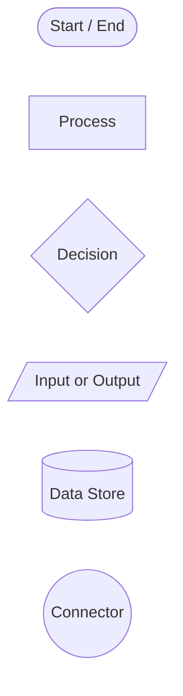

#### 1. High-Level System Architecture

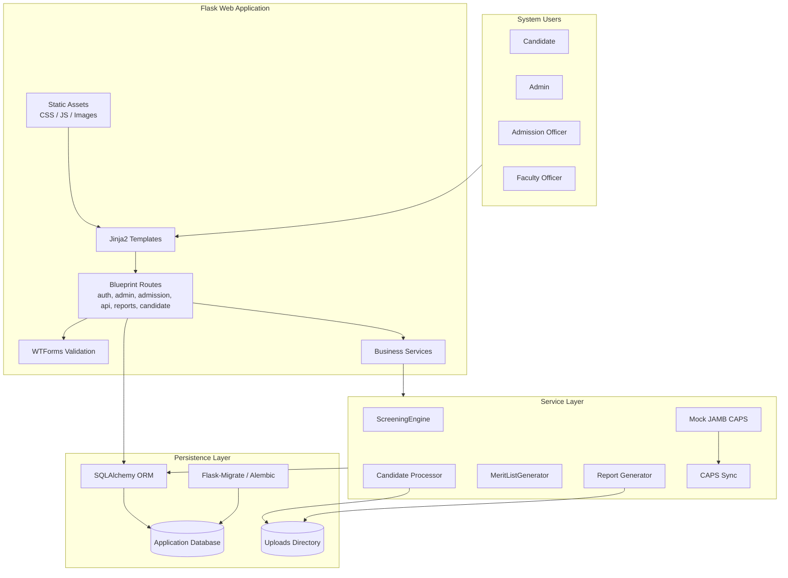

#### 2. Application Component Diagram

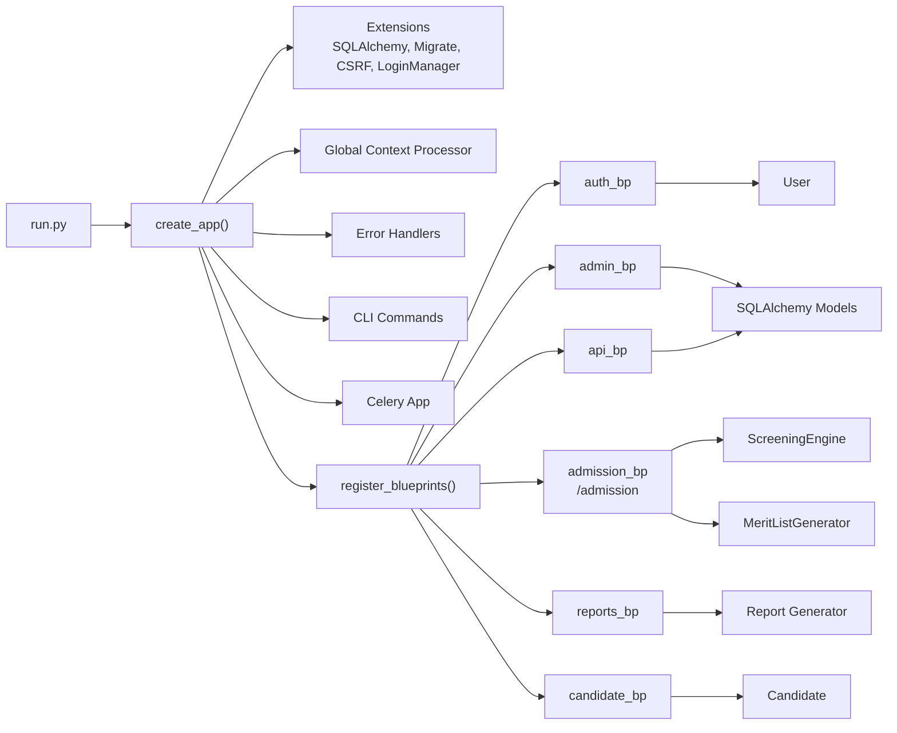

#### 3. UML Class Diagram

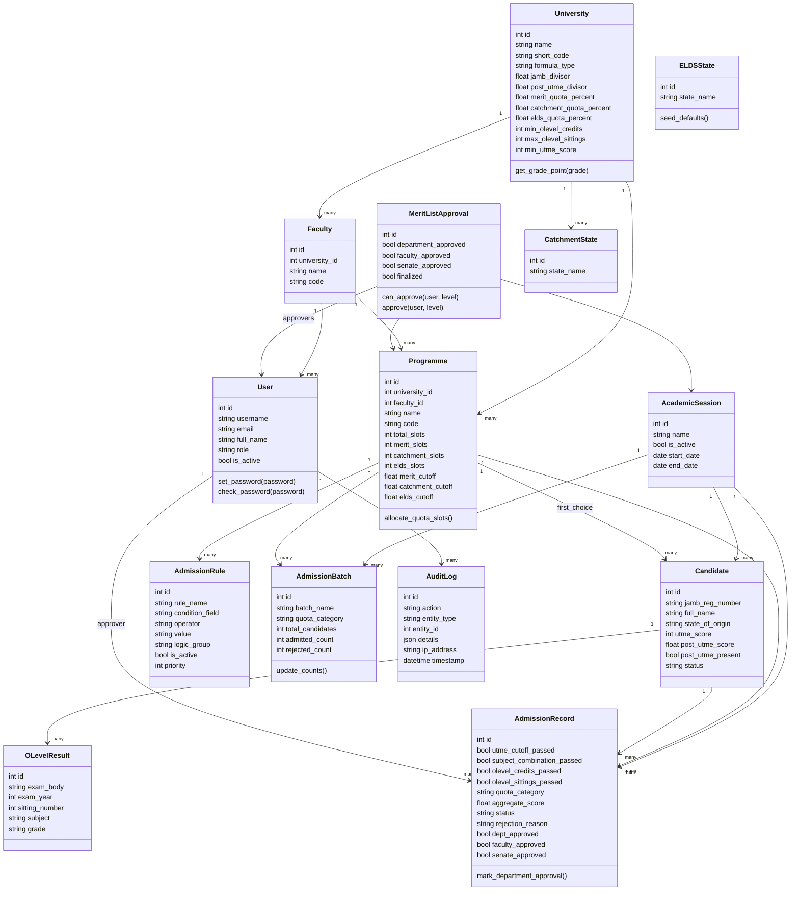

#### 4. Entity Relationship Diagram

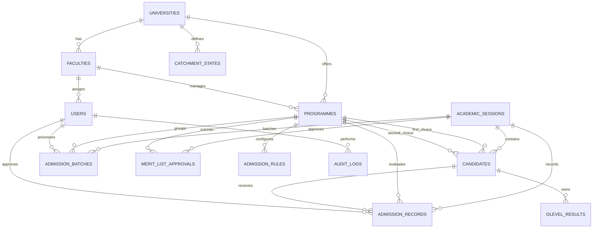

#### 5. Candidate Screening Activity Diagram

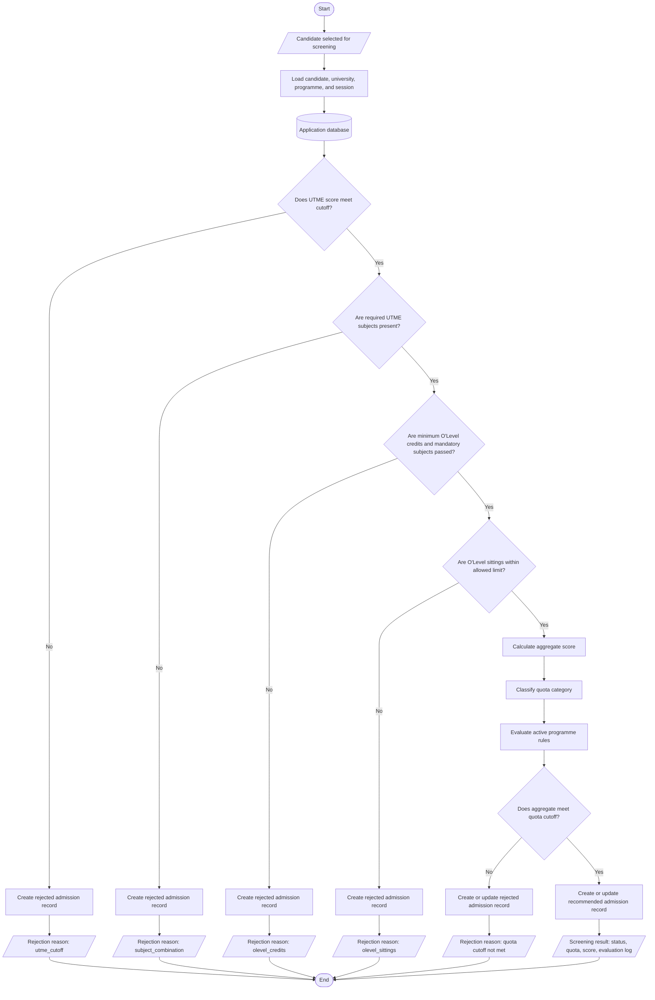

#### 6. Screening Sequence Diagram

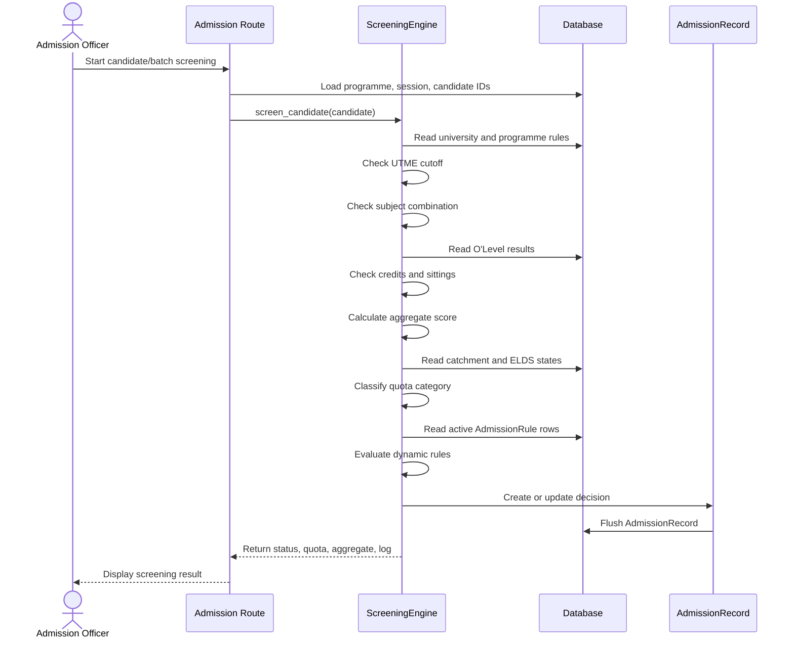

#### 7. Merit List and Quota Allocation Flow

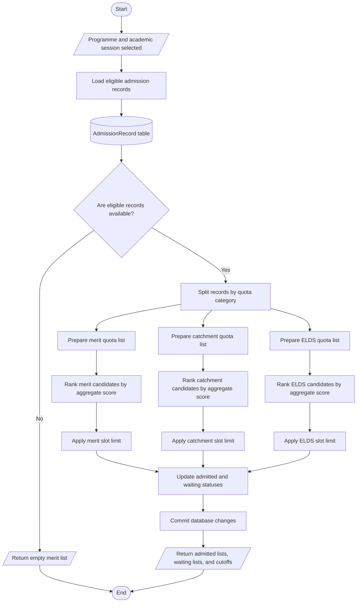

#### 8. Multi-Level Approval State Diagram

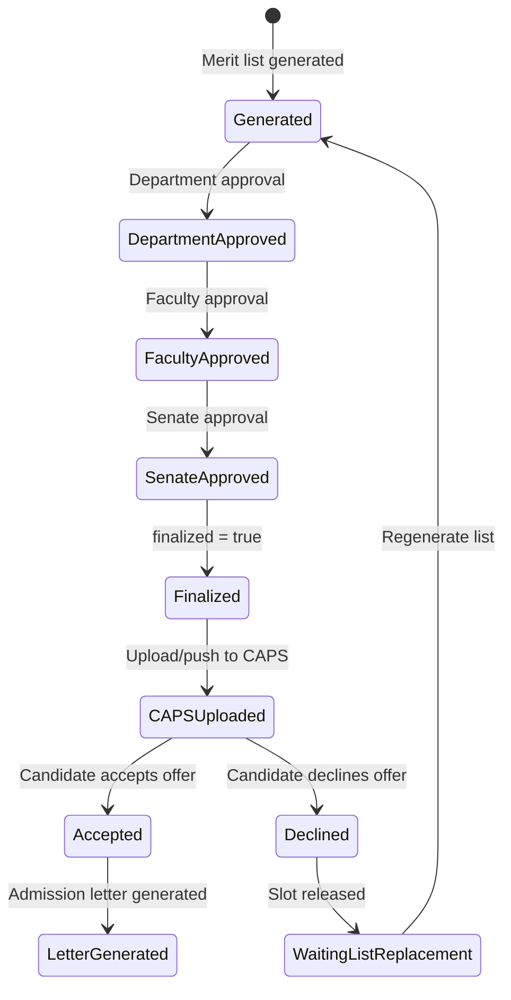

#### 9. Candidate Portal Use Case Diagram

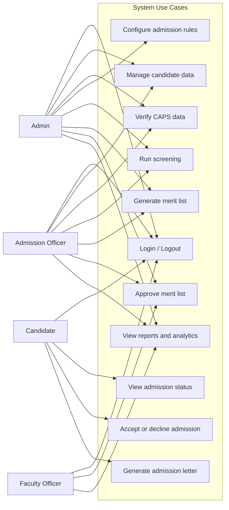

#### 10. System Use Case Diagram

```mermaid
flowchart LR
    CandidateActor["Candidate"]
    AdminActor["Admin"]
    AdmissionActor["Admission Officer"]
    FacultyActor["Faculty Officer"]
    SenateActor["Senate / Final Approver"]
    MockCapsActor["Mock JAMB CAPS"]

    subgraph AADS["Automated Admission Decision System"]
        UCLogin(("Authenticate user"))
        UCSubmitData(("Submit / update candidate data"))
        UCViewStatus(("View admission status"))
        UCAcceptOffer(("Accept or decline admission"))
        UCGenerateLetter(("Generate admission letter"))

        UCManageUsers(("Manage users and roles"))
        UCManageProgrammes(("Manage faculties and programmes"))
        UCConfigureRules(("Configure admission rules"))
        UCConfigureQuotas(("Configure quotas and cutoffs"))
        UCVerifyCandidates(("Verify candidate data"))
        UCRunScreening(("Run rule-based screening"))
        UCGenerateMerit(("Generate merit list"))
        UCApproveDepartment(("Approve at department level"))
        UCApproveFaculty(("Approve at faculty level"))
        UCApproveSenate(("Approve at senate level"))
        UCPushCaps(("Upload admission list to CAPS"))
        UCCapsStatus(("Check CAPS upload status"))
        UCReports(("View reports and analytics"))
        UCAudit(("View audit trail"))
    end

    CandidateActor --> UCLogin
    CandidateActor --> UCSubmitData
    CandidateActor --> UCViewStatus
    CandidateActor --> UCAcceptOffer
    CandidateActor --> UCGenerateLetter

    AdminActor --> UCLogin
    AdminActor --> UCManageUsers
    AdminActor --> UCManageProgrammes
    AdminActor --> UCConfigureRules
    AdminActor --> UCConfigureQuotas
    AdminActor --> UCVerifyCandidates
    AdminActor --> UCRunScreening
    AdminActor --> UCGenerateMerit
    AdminActor --> UCApproveDepartment
    AdminActor --> UCApproveFaculty
    AdminActor --> UCApproveSenate
    AdminActor --> UCPushCaps
    AdminActor --> UCCapsStatus
    AdminActor --> UCReports
    AdminActor --> UCAudit

    AdmissionActor --> UCLogin
    AdmissionActor --> UCVerifyCandidates
    AdmissionActor --> UCRunScreening
    AdmissionActor --> UCGenerateMerit
    AdmissionActor --> UCApproveDepartment
    AdmissionActor --> UCPushCaps
    AdmissionActor --> UCCapsStatus
    AdmissionActor --> UCReports

    FacultyActor --> UCLogin
    FacultyActor --> UCApproveFaculty
    FacultyActor --> UCReports

    SenateActor --> UCLogin
    SenateActor --> UCApproveSenate
    SenateActor --> UCReports

    MockCapsActor --> UCVerifyCandidates
    MockCapsActor --> UCPushCaps
    MockCapsActor --> UCCapsStatus
    MockCapsActor --> UCAcceptOffer

    UCRunScreening -. includes .-> UCVerifyCandidates
    UCGenerateMerit -. includes .-> UCRunScreening
    UCPushCaps -. requires .-> UCApproveSenate
    UCGenerateLetter -. requires .-> UCAcceptOffer
```

#### 11. Route to Service Dependency Diagram

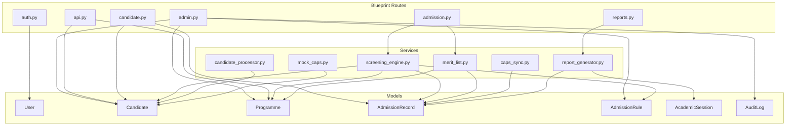

#### 12. Deployment Diagram

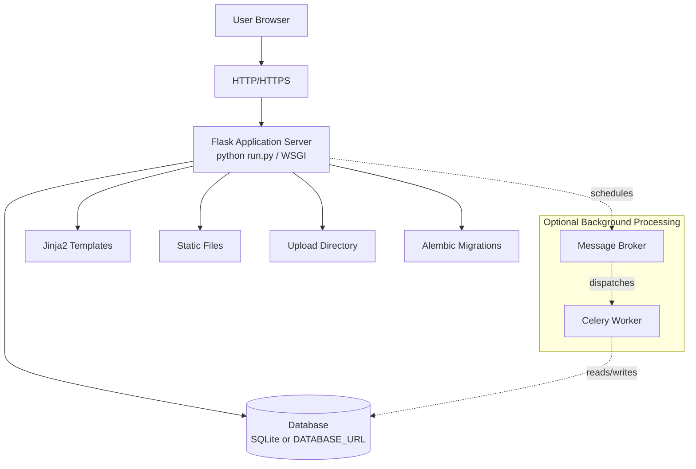

#### 13. Data Flow Diagram

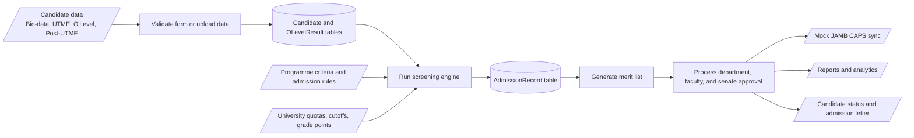

### Key Features

#### 1. Rule-Based Screening
- Configurable admission rules for each programme
- Automatic candidate evaluation based on:
  - UTME scores and subject combinations
  - O'Level results and credit requirements
  - Quota allocations (Merit, Catchment, ELDS)
- Aggregate score calculation with customizable formulas

#### 2. Quota Management
- Merit quota (45% default)
- Catchment quota (35% default) 
- ELDS quota (20% default)
- Configurable per university and programme

#### 3. Multi-Level Approval System
- Department level approval
- Faculty level approval
- Senate level approval
- Audit trail for all actions

#### 4. Reporting & Analytics
- Comprehensive admission statistics
- Export functionality (Excel, PDF)
- Real-time dashboards
- System health monitoring

#### 5. User Interface Enhancements
- Loading spinners for async operations
- Confirmation modals for destructive actions
- Breadcrumb navigation
- Quick help tooltips
- Responsive design for mobile devices

### Database Models

#### Core Entities
- **AcademicSession**: Academic year management
- **University**: University configuration and settings
- **Faculty**: Faculty/college management
- **Programme**: Academic programmes with admission criteria
- **Candidate**: Student applications and data
- **AdmissionRecord**: Admission decisions and approvals
- **User**: System users with role-based access

#### Supporting Models
- **AdmissionRule**: Configurable screening rules
- **OLevelResult**: O'Level examination results
- **CatchmentState**: University catchment areas
- **ELDSState**: Educationally Less Developed States
- **AuditLog**: System audit trail

### CLI Commands

#### Database Management
```bash
# Seed database with initial data
flask seed

# Generate test candidates
flask generate-candidates 100

# Create admin user interactively
flask create-admin
```

### Configuration

#### Environment Variables
```bash
FLASK_ENV=development
SECRET_KEY=your-secret-key
DATABASE_URL=sqlite:///admission.db
UPLOAD_FOLDER=uploads
```

#### University Settings
- JAMB divisor: 8.0
- Post-UTME divisor: 4.0
- Grade points mapping (A1=8, B2=7, etc.)
- Minimum UTME score: 140
- Minimum O'Level credits: 5
- Maximum O'Level sittings: 2

### Security Features
- Role-based access control (Admin, Faculty Officer, Admission Officer)
- CSRF protection
- Password hashing
- Session management
- Audit logging

### API Integration
- Mock JAMB CAPS integration for testing
- Configurable endpoints for production integration
- Data validation and error handling

### Testing
- Unit tests for core functionality
- Integration tests for workflows
- Test data generation utilities
- Database seeding for test environments

### Deployment Considerations
- Production-ready configuration
- Environment-specific settings
- Database migration support
- Static asset management
- Error handling and logging

### Author
**Emmanuel Onucheojo Ocheme (22L1SE0086)**  
Software Engineering, CUSTECH

### License
© 2025 Confluence University of Science and Technology, Osara  
Automated Rule-Based Admission Decision System
